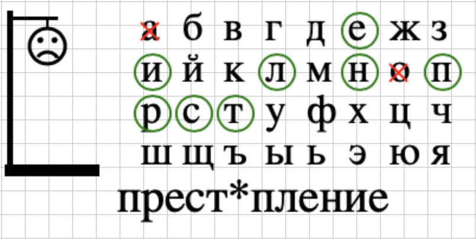

# Игра "Виселица"

Необходимо доработать имеющийся код - написать логику работы игры.

[Стартовый код для реализации проекта](https://replit.com/@vovachebr/hangman). 

Игрок отгадывает слово, вводя буквы на клавиатуре (на кириллице). Если буква угадана, она отобразится на своей позиции в загаданном слове. В противном случае будет рисоваться человечек на виселице. Если игрок ошибается 7 раз, он проигрывает.

